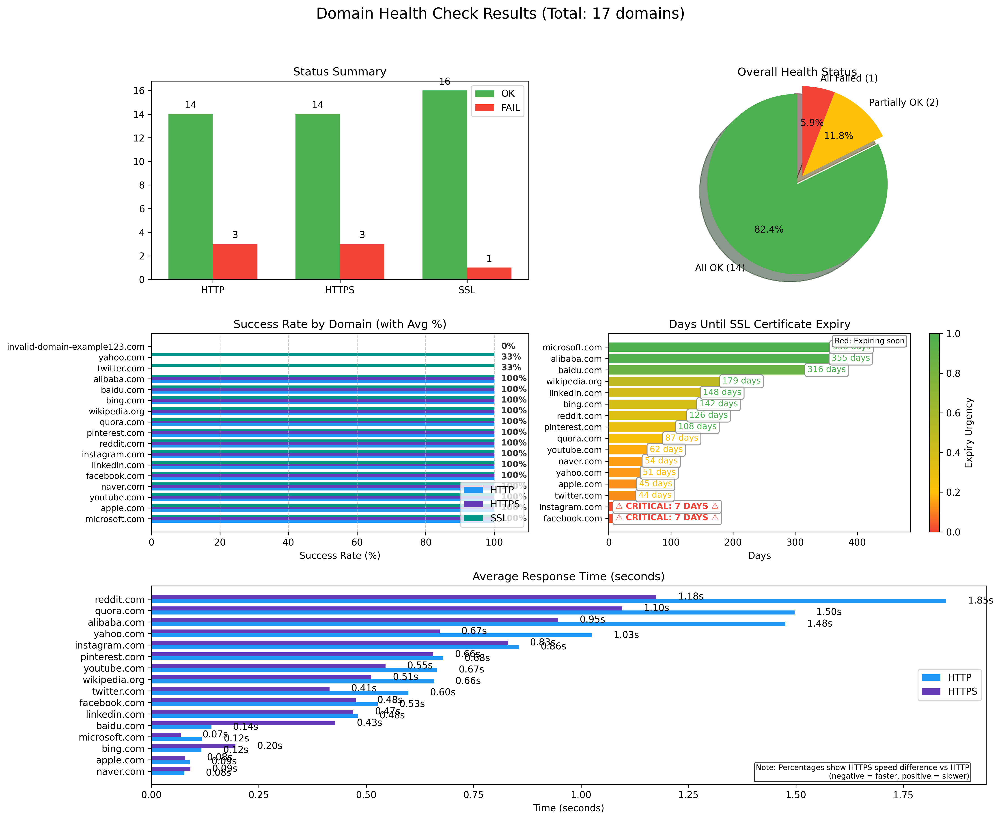

# Domain Health Checker

A comprehensive tool for monitoring and reporting the health status of multiple domains, including HTTP/HTTPS accessibility and SSL certificate validity.

### Features

- Multiple Domain Testing: Test a list of domains from a single input file
- Comprehensive Health Checks:
  - HTTP status (200 OK)
  - HTTPS status (200 OK)
  - SSL certificate validity
  - SSL certificate expiration date
  - Response time measurements
- Configurable Test Count: Adjustable number of connection attempts for more accurate results
- Multi-format Reporting:
  - Visual report with charts and graphs
  - Detailed text report with statistics
  - Warning alerts for expiring SSL certificates
- Visualizations:
  - Status summary bar chart
  - Overall health pie chart
  - Success rate comparison
  - SSL certificate expiry timeline
  - Response time comparison

### Requirements

- Python 3.11.x

### Usage

```bash
# Default target
help:
 @echo "Available commands:"
 @echo "  make up      - Start the domain health checker container"
 @echo "  make down    - Stop and remove the domain health checker container"

# Start the container
up:
 @echo "Starting Domain Health Checker..."
 docker compose up --build
 @echo "Container started. Use 'docker-compose logs -f' to view logs."

# Stop and remove the container
down:
 @echo "Stopping Domain Health Checker..."
 docker compose down
 @echo "Container stopped and removed."
```

### Example output


